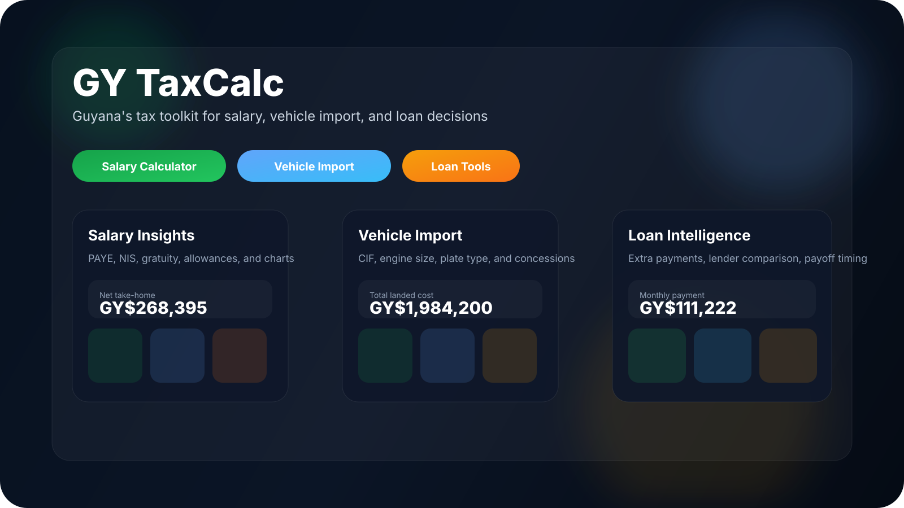

# GY TaxCalc

<div align="center">


[Live Demo](https://kareemschultz.github.io/gy-taxcalc/) · [Changelog](./CHANGELOG.md) · [Policy Guide](./app/(app)/tax-info/page.tsx) · [GitHub](https://github.com/kareemschultz/gy-taxcalc)

</div>

<p align="center">
  
</p>

## Overview

GY TaxCalc is a Guyana-focused tax toolkit built with Next.js 15, shadcn/ui, Tailwind CSS v4, Framer Motion, and Recharts.

It currently ships as a static-export friendly app with:

- Salary and PAYE calculations
- Vehicle import tax calculations
- Loan amortization and payoff intelligence
- Scenario comparison
- Policy, FAQ, analytics, and reference hubs

## Routes

| Route | Purpose |
| --- | --- |
| `/overview` | Start page and launcher |
| `/dashboard` | Salary / tax calculator |
| `/vehicle` | Vehicle import calculator |
| `/loan` | Loan calculator |
| `/compare` | Side-by-side scenario comparison |
| `/planner` | Annual planning helper |
| `/insights` | Reference-style insights hub |
| `/intelligence` | Decision-focused what-if hub |
| `/analytics` | Trend and chart hub |
| `/tax-info` | Policy guide and 2026 reference notes |
| `/faq` | Common questions |
| `/changelog` | Release history |

## Highlights

### Salary Calculator

- 5 payment frequencies: daily, weekly, fortnightly, monthly, yearly
- Detailed or simple allowance entry
- Taxable and non-taxable allowance breakdowns
- Overtime and second-job exclusions
- Child, insurance, loan, and credit union deductions
- Qualification allowances: ACCA, Masters, PhD
- Gratuity support and salary increase simulator
- Breakdown, annual, charts, simulator, and info tabs
- Mobile sticky result bar
- PDF-ready export view

### Vehicle Import

- FOB to CIF converter
- Vehicle age, plate type, importer type, and fuel type controls
- CC preset dropdown with custom CC entry
- Budget 2026 rules surfaced in the UI
- Breakdown table and quick reference info cards
- Mobile sticky result bar

### Loan Calculator

- Auto, personal, mortgage, and custom loan modes
- Lender presets and interest ranges
- GYD / USD principal support
- Extra monthly, one-time, and periodic lump sums
- Amortization schedule with pagination
- Bank comparison cards
- Loan intelligence tab:
  - what-if lump sum matrix
  - tie / optimal-value detection
  - payoff timeline
  - interest saved summary
  - progress ring
- 4 loan charts powered by Recharts
- Mobile sticky result bar

### Reference and Discovery Hubs

- `Insights` for quick reference takeaways
- `Intelligence` for decision tools and shortcuts
- `Analytics` for visual summaries and trends
- `Policy Guide` for 2026 rates and reference notes
- `FAQ` and `Changelog` for support and release history

## Tech Stack

- Next.js 15.3 App Router
- React 19 client components
- Tailwind CSS v4
- shadcn/ui
- Framer Motion 11
- Recharts 2
- Lucide React
- next-themes

## Architecture Notes

- Static export is enabled in `next.config.ts`
- Calculator logic lives in `lib/`
- Pages and components stay client-side where interactive state is needed
- The app uses reusable shared primitives:
  - `Hint`
  - `CurrencyInput`
  - `Section`
  - `ResultCard`
  - `InfoCard`
  - `StickyResultsBar`

## Local Development

```bash
npm install
npm run dev
```

## Build

```bash
npm run build
```

## Deployment

The repo is configured for GitHub Pages style static hosting. The current branch is:

- `claude/nextjs-shadcn-refactor-nU58h`

## Notes

- Vehicle charts were intentionally skipped.
- No localStorage persistence is used for inputs; theme persistence is handled by `next-themes`.
- The policy guide centralizes long-form tax and vehicle reference content so the calculator screens stay cleaner.

## Data Sources

- Guyana Revenue Authority tax and vehicle guidance
- Guyana Budget 2026 measures
- Lender rate references used for comparison presets

## Disclaimer

This project is an independent calculator suite and is not affiliated with the Guyana Revenue Authority or any lender.

## Credits

Built by Kareem Schultz.

GitHub: [kareemschultz](https://github.com/kareemschultz)

